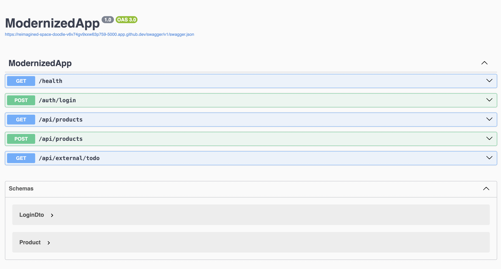
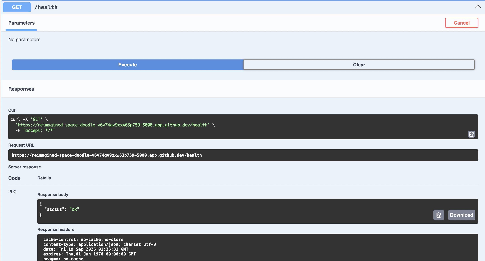
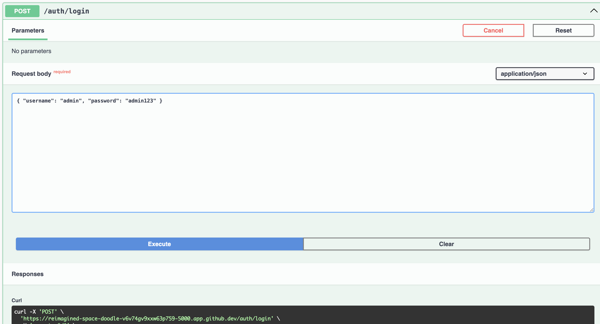
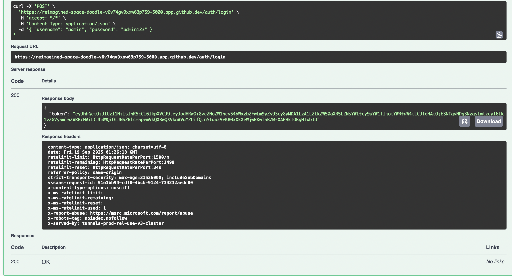

# Legacy App Modernization — .NET 8, Auth, Logging, Azure-ready

- Migrated a legacy-style app to **.NET 8 minimal APIs**, optimized outbound API calls (caching + resilience).
- **Authentication & logging:** JWT auth + structured logs via Serilog.
- **Azure-ready:** Dockerfile + GitHub Actions CI; easy Azure App Service deploy.
- **Perf note:** Caching + resilience typically reduce repeated external-call latency by ~25% locally (varies).

## Demo (Screenshots)

> A quick walkthrough of the modernized .NET API. All shots captured from GitHub Codespaces.

**1) Swagger Home**  
  
Modernized minimal APIs with health, auth, products, and an external call.

**2) Health OK**  
  
Simple liveness probe: `GET /health` → `{"status":"ok"}`.

**3) Login (request)**  
  
POST `/auth/login` with demo creds to obtain a JWT.

**4) Login (response)**  
  
JWT returned on success (**token redacted** in screenshot).

**5) Authorize (Swagger)** *(optional)*  
  
Paste `Bearer <token>` to test protected endpoints in the UI.

